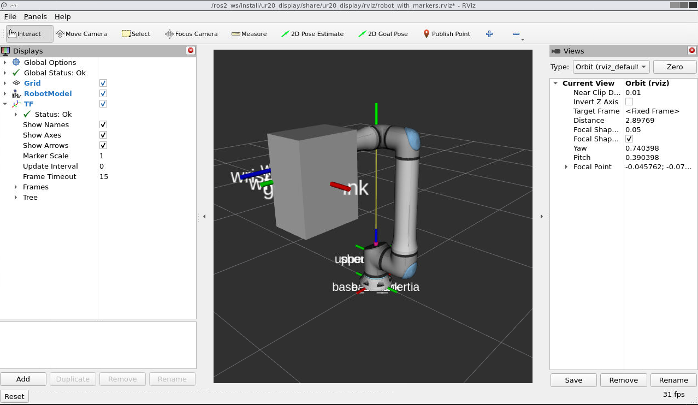

# Progressive Robotics Technical Assessment

* Development for this project took place in a Ubuntu 22.04 Linux machine. 
* Docker is required for this project. By simply installing [Docker Desktop](https://www.docker.com/products/docker-desktop/), all of the necessary docker components should be installed.


## Build Instructions

1. Clone the project locally:
    ```
    git clone https://github.com/DimYfantidis/progressive-robotics-assessment
    ```
2. Pull the dependencies:
    ```
    git submodule update --init --remote
    ```
3. Switch to the submodule's `humble` branch:
    ```
    cd ./src/universal_robots && git checkout humble && git pull && cd ../..
    ```
4. Replace the dependency's `ur_macro.xacro` file with with the one found under the `./resources/` directory. This description includes a gripper attached at the flange of the arm:
    ```
    cp ./resources/ur_macro.xacro ./src/universal_robots/urdf/
    ```
5. Start the Docker daemon. This could be achieved by simply opening the Docker Desktop app.

6. Open a terminal and navigate to the project's root directory.

7. Build the docker image and start the [noVNC](https://wiki.ros.org/docker/Tutorials/GUI) image using:
    ```
    docker compose up -d dimitris-container novnc
    ```
    When finished, the image is built and the container will start running in the background while blocking the terminal. `noVNC` is necessary for accessing graphical elements while working within containers.


## Execution Instructions

1. If the container is not already running: By typing the following command in a shell within the root directory, the container should start by using the already built image:
    ```
    docker compose up --no-build -d dimitris-container novnc
    ```
    Make sure that the docker daemon is running in the background.

2. In a new terminal, launch a BASH shell inside the running container using:
    ```
    docker exec -it dimitris-container /bin/bash
    ```
    This can be repeated in as many terminals as needed, allowing multiple ROS 2 components to operate concurrently.

3. Top stop the containers' execution, type `exit` in each terminal accessed within the aforementioned command (guest terminals) and then type `docker compose down` in the root directory of the project (host machine).

## Build the ROS2 Workspace 

Within the BASH shell inside the running container, navigate into the workspace and build it by typing:
```
cd ros2_ws && colcon build --symlink-install
```

## Run the implemented ROS2 nodes

* You will first need to source the workspace by typing:
    ```
    source install/setup.bash
    ```

* To execute the service client node, type:
    ```
    ros2 run linear_algebra_common client
    ```

    Once it starts the client will start publishing to the "client" topic (can be specified as different through the `topic` node parameter). 
    While the server is unavailable (e.g. it hasn't started yet), the client will attempt to connect with it every one second, logging every attempt
    in the terminal.  

    The node will notify the user when communication with the service has been established and when the response is received along with its result. 
    After that the node's publisher will keep publishing messages forever until interrutped.  

    The client fetches the matrix and vector data from yaml files found under the `config` directory, found within the `linear_algebra_resources` package. 
    By default the client reads the `client_data.yaml` file but can be instructed to read from another YAML file under the `config` directory by using the 
    node's `yaml_filename` parameter. In the case of any ill-formatted input within the YAML file, the user will be informed and the request will not be sent.  

* To execute the service server node, type:
    ```
    ros2 run linear_algebra_common service
    ```

    Once it starts, the server will notify the user when it's ready (listening for requests), when it has received a request and when it has processed it. 
    In the case of receiving wrong input from the client (matrix and vector dimension mismatch), the server will log an error, mark the processing of 
    the request as unsuccessful and return from the service callback prematurely.

* There is no specific sequence in which the client and server nodes must be executed or stopped.


## UR20 Robotic Arm Visualization

By typing the following command within the `dimitris-container`'s shell, the modifed version of the UR20 robot can be displayed in RVIZ
```
ros2 launch ur20_display inspect_ur20.launch.py
```
In order to see RVIZ's GUI and interact with its elements, the following address should be visited in the host machine's local browser: http://localhost:8080/vnc.html. Click the "Connect" button to view the robot. This requires that noVNC is running (see [Execution Instructions](#execution-instructions)).

The parameters that specify the command pose can be found within the [ur20_joint_configuration_publisher](./src/ur20_display/config/ur20_joint_configuration_publisher.yaml) YAML file found in the `./src/ur20_display/config/` directory.



The above screenshot shows the robotic arm's joint configuration, its TF frames, along with their names, which is specified as:
```
ur20_joint_configuration_publisher:
  ros__parameters:
    joint_names: [
      'shoulder_pan_joint',
      'shoulder_lift_joint',
      'elbow_joint',
      'wrist_1_joint',
      'wrist_2_joint',
      'wrist_3_joint',
      'gripper_joint'
    ]
    joint_positions: [
      0.0, -1.57, 1.57, -1.57, 0.0, 0.0, 0.0
    ]
    joint_velocities: [
      .0, .0, .0, .0, .0, .0, .0
    ]
    joint_efforts: [
      .0, .0, .0, .0, .0, .0, .0
    ]
```
The `joint_positions` can be changed before relaunching [inspect_ur20.launch.py](./src/ur20_display/launch/inspect_ur20.launch.py) to visualize different joint configurations.